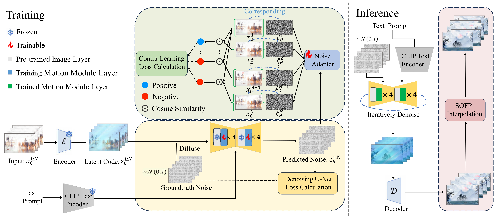
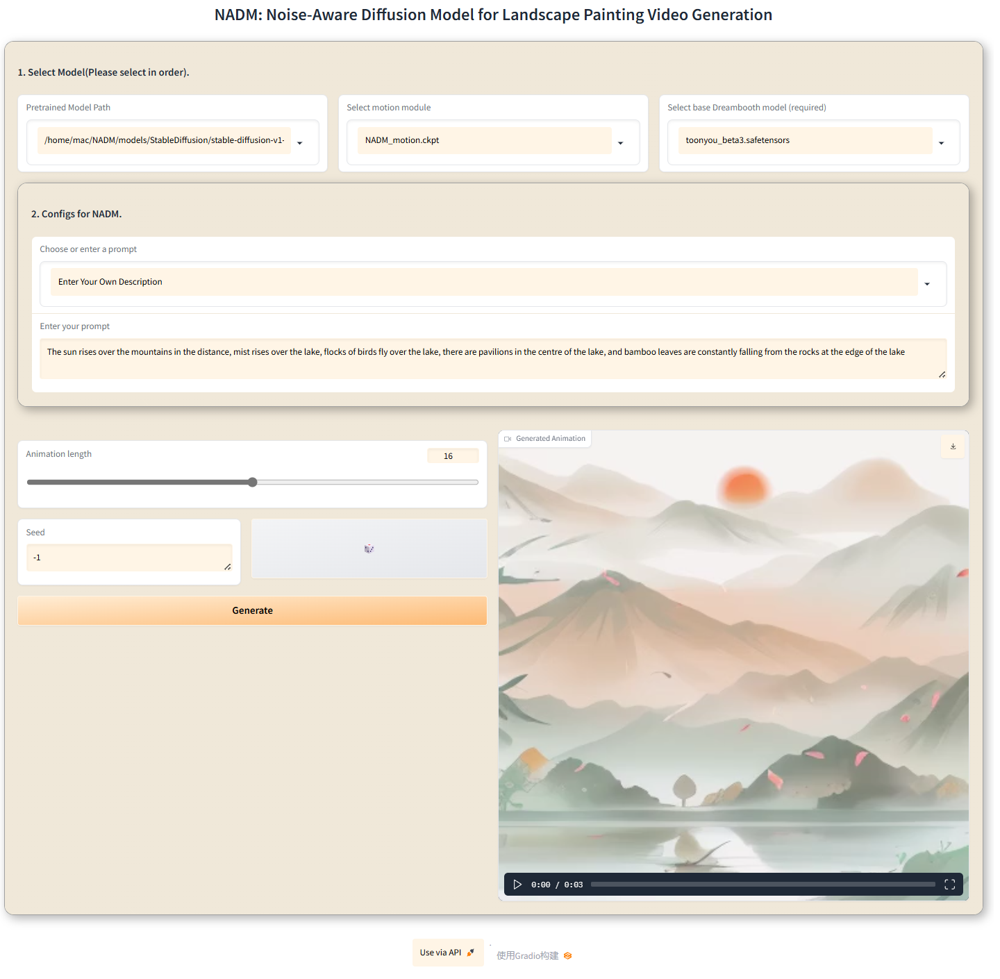
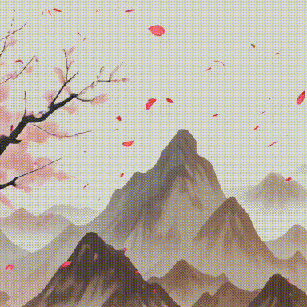
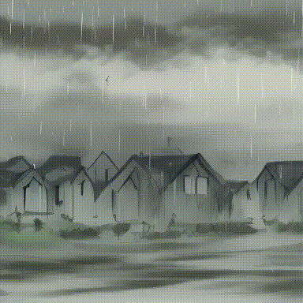

# NADM

This repository is the official implementation of [NADM].

**[NADM: Noise-Aware Diffusion Model for Landscape Painting Video Generation]**


## Introduction

<br>

Landscape painting is a gem of cultural and artistic heritage that showcases the splendor of nature through the deep observations and imaginations of its painters. Limited by traditional techniques, these artworks were confined to static imagery in ancient times, leaving the dynamism of landscapes and the subtleties of artistic sentiment to the viewer's imagination. Recently, emerging text-to-video (T2V) diffusion methods have shown significant promise in video generation, providing hope for the creation of dynamic landscape paintings. However, current T2V methods focus on generating natural videos, emphasizing the capture of details and the authenticity of physical laws. In contrast, landscape painting videos emphasize the overall dynamic aesthetic. Besides, challenges such as the lack of specific datasets, the intricacy of artistic styles, and the creation of extensive, high-quality videos pose difficulties for these models in generating landscape painting videos. In this paper, we propose LPV-HD (Landscape Painting Videos-High Definition), a novel T2V dataset for landscape painting videos, and NADM (Noise-Aware Diffusion Model), a T2V model that utilizes Stable Diffusion. Specifically, we present a motion module featuring a dual attention mechanism to capture the dynamic transformations of landscape imageries, alongside a noise adapter to leverage unsupervised contrastive learning in the latent space to ensure the overall beauty of the landscape painting video. Following the generation of keyframes, we employ optical flow for frame interpolation to enhance video smoothness. Our method not only retains the essence of the landscape painting imageries but also achieves dynamic transitions, significantly advancing the field of artistic video generation.

## LPV-HD(Our Dataset)

We have created LPV-HD, a pioneering text-to-landscape painting video dataset, which includes 1,300 high-definition text-video pairs. You can download it from [LPV-HD](https://drive.google.com/drive/folders/1uw_rPz5zbCpGO1yBQ4X-IubVB_jXEHwP?usp=drive_link).

## Setups for Inference

### Prepare Environment

***NADM takes only ~24GB VRAM to train and inference, and run on a single RTX3090 !!***

```
git clone https://github.com/llzlh21/NADM.git
cd NADM

conda env create -f environment.yaml
conda activate nadm
```

### Download Base T2I
```
git lfs install
git clone https://huggingface.co/runwayml/stable-diffusion-v1-5 models/StableDiffusion/

```
### Download Motion Module Checkpoints
You can directly download the motion module checkpoints from [NADM-motion.ckpt]https://drive.google.com/file/d/1aDMdAe0o8OTCmy9_CF7UGEqYyKCx-yYu/view?usp=drive_link, then put them in `models/Motion_Module/` folder.

### Prepare Personalize T2I
Here we provide inference configs for a demo T2I on CivitAI. 
You may run the following bash script to download this checkpoint.

```
bash download_bashscripts/ToonYou.sh
```

### Inference
We have created a Gradio demo to make NADM easy to use. To launch the demo, please run the following commands:
```
conda activate nadm
python app.py
```
(We provide two preset text descriptions, or you can also input your own custom description.)

<br>
## Steps for Training

### Dataset
Before initiating the training process, ensure to download the video files and csv annotations from [LPV-HD](https://drive.google.com/drive/folders/1uw_rPz5zbCpGO1yBQ4X-IubVB_jXEHwP?usp=drive_link) to your local machine. It's important to note that the training script we provide as an example requires all video files to be stored in a single designated folder.

### Configuration
After dataset preparations, update the below data paths in the config `.yaml` files in `configs/training/` folder:
```
train_data:
  csv_path:     [Replace with csv Annotation File Path]
  video_folder: [Replace with Video Folder Path]
  sample_size:  256
```
Other training parameters (lr, epochs, validation settings, etc.) are also included in the config files.

### Training
To train motion modules,do
```
torchrun --nnodes=1 --nproc_per_node=1 train.py --config configs/training/training.yaml
```


## Gallery
Here we demonstrate several excellent results we found in our experiments.

<table class="center">
    <tr>
    <td></td>
    <td></td>
    <td></td>
    <td></td>
    <td></td>
    </tr>
</table>
<table class="center">
    <td></td>
    <td></td>
    <td></td>
    <td></td>
    <td></td>
    </tr>
</table>


